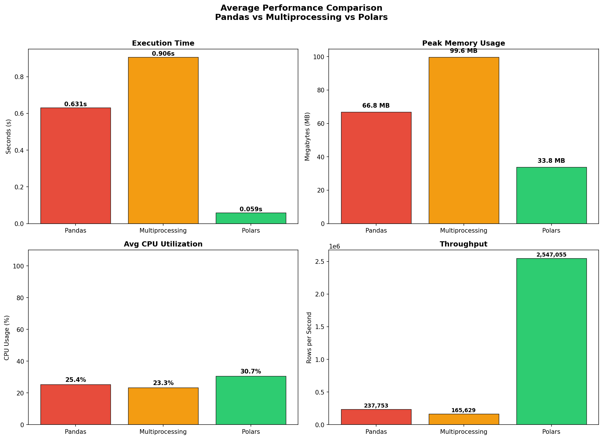

# Malaysian Used-Car Listings: Scraping, Cleaning & Performance Benchmarking

An end-to-end data pipeline built around ~150,000 used-car listings scraped from a Malaysian
car marketplace. The project covers the full lifecycle — **collecting** messy real-world data,
**cleaning** it into an analysis-ready dataset, and **benchmarking** three different data-processing
engines to find out which one actually pays off at this scale.

The headline finding: for a dataset of this size, **Polars is ~10× faster than pandas**, while
**Python multiprocessing is actually *slower* than serial pandas** — the overhead of splitting,
spawning workers, and merging outweighs the compute being parallelized.

---

## 📌 Project Overview

| Stage | Goal | Output |
|-------|------|--------|
| **1. Scraping** | Collect ~150k listings reliably over a long run | Raw CSV (~150k rows) |
| **2. Cleaning** | Parse messy fields into a tidy schema | Cleaned CSV (149,882 rows × 12 cols) |
| **3. Benchmarking** | Compare pandas vs multiprocessing vs Polars | Metrics + comparison chart |

---

## 🕸️ Stage 1 — Web Scraping

An **asynchronous scraper** built to survive a full large-scale run rather than dying partway through.

**Key features:**
- Asynchronous page fetching with a **concurrency semaphore** to control parallel requests
- **Automatic retries** with exponential backoff on failures and rate-limit (HTTP 403 / 429) responses
- **Resumable progress** — state is saved so an interrupted run can pick up where it left off
- **Deduplication** by listing ID to avoid double-counting
- Basic anti-bot handling (custom user-agent, blocking of unneeded resources for speed)

**Fields collected:** title, year, price, monthly payment, mileage, transmission, seller type,
location, condition, and listing URL.

---

## 🧹 Stage 2 — Data Cleaning

A deterministic, regex-based cleaning pipeline that turns messy raw text into structured columns.

| Raw value | Cleaned value | Logic |
|-----------|---------------|-------|
| `"RM 63,999"` | `63999.0` | strip non-numeric characters |
| `"RM 830 / month"` | `830.0` | extract numeric payment |
| `"75 - 80K KM"` | `77500.0` | parse range → **midpoint** |
| `"Selangor, Petaling Jaya"` | `state` + `city` | split into two columns |
| free-text seller | `Dealer / Private / ...` | normalize to known categories |

**Additional steps:** duplicate removal, price/year sanity filtering (e.g. RM 1k–5M, year 1980–2026),
median imputation for missing monthly payments, and categorical standardization.

**Result:** a tidy dataset of **149,882 rows × 12 columns**, ready for analysis.

---

## ⚡ Stage 3 — Performance Benchmarking

The same workload — **Load → Filter → Feature Engineering → Aggregation** — implemented three ways and
measured for execution time, peak memory, CPU utilization, and throughput (averaged over 5 runs).

| Method | Description |
|--------|-------------|
| **Pandas (Baseline)** | Single-threaded, no parallelism |
| **Multiprocessing** | `multiprocessing` / joblib across all CPU cores |
| **Polars** | Rust backend with lazy evaluation and automatic multi-threading |

### Results

| Method | Exec Time | Peak Memory | Throughput | Speedup |
|--------|-----------|-------------|------------|---------|
| Pandas | 0.63 s | 66.8 MB | ~238k rows/s | 1.00× |
| Multiprocessing | 0.91 s | 99.6 MB | ~166k rows/s | **0.70×** ⬇️ |
| **Polars** | **0.06 s** | **33.8 MB** | **~2.5M rows/s** | **~10×** ⬆️ |



### Key Takeaways
- **Polars wins decisively** — ~10× faster than pandas using roughly half the memory.
- **Multiprocessing was slower than the serial baseline.** At this scale, the cost of chunking,
  process spawning, and result merging outweighs the parallel compute — the "obvious" optimization
  was a net loss.
- The real lesson: **match the tool to the data scale** rather than reaching for parallelism by default.

---

## 🛠️ Tech Stack

- **Python**
- **Playwright** (async web scraping)
- **pandas** + **NumPy** (cleaning & baseline processing)
- **Polars** (high-performance processing)
- **multiprocessing** / **joblib** (parallel processing)
- **psutil**, **tracemalloc** (performance instrumentation)
- **matplotlib** / **seaborn** (visualization)
- **Jupyter Notebook**

---

## 📁 Repository Structure

```
.
├── carlist_scraper_pw.py        # Asynchronous web scraper
├── clean_data.ipynb             # Data cleaning pipeline
├── optimise.ipynb               # Performance benchmark (pandas vs MP vs Polars)
├── mp_helpers.py                # Worker functions for multiprocessing
├── performance_comparison.png   # Benchmark results chart
└── README.md
```

> **Note:** The raw and cleaned CSV datasets are excluded from the repository due to size.

---

## 🚀 Getting Started

```bash
# 1. Install dependencies
pip install playwright pandas numpy polars joblib psutil matplotlib seaborn
playwright install chromium

# 2. Run the scraper (test mode collects a small sample)
python carlist_scraper_pw.py --test
# Full run:
python carlist_scraper_pw.py

# 3. Open the notebooks for cleaning & benchmarking
jupyter notebook clean_data.ipynb
jupyter notebook optimise.ipynb
```

---

## 🔮 Future Improvements
- Make all three pipelines strictly identical for a perfectly fair comparison.
- Measure memory consistently across engines (Rust allocations aren't visible to `tracemalloc`).
- Repeat the benchmark across a **range of dataset sizes** (thousands → tens of millions of rows)
  to find the crossover point where parallel/distributed approaches finally overtake a fast
  single-machine engine.

---

*Built as a university data-engineering project exploring practical performance optimization on
real-world data.*
